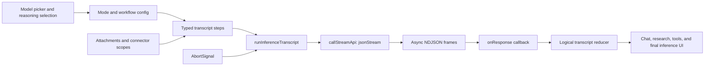

# Notion AI client surface map

## Scope and confidence

This map is based only on the deduplicated JavaScript recovered from the baseline HAR. It does not inspect request headers, cookies, credentials, private API response bodies, or user content. A finding is included only when the bundle contains a direct AI-specific API call, a typed transcript discriminator, an explicit configuration field, or a concrete control-flow relationship. Generic occurrences of words such as `model`, `agent`, `search`, and `ai` were excluded.

The strongest result is a client pipeline, not just a list of keywords:

## Confirmed AI API event names

These are literal `eventName` values adjacent to a concrete API client method. Only `runInferenceTranscript` is also confirmed by the live HAR as the literal path `/api/v3/runInferenceTranscript`; the other entries should be called API event names until runtime URL routing is observed.

| Event name | Client method | Purpose | Static source |
| --- | --- | --- | --- |
| `runInferenceTranscript` | `callStreamApi` | Core transcript inference stream | `ActionBarUI…js`, module 855225 |
| `getAvailableModels` | `callCellCompatibleApi` | Model-picker entries, policy state, and BYOK metadata | `60333…js`, module 95496 |
| `getAIUsageEligibilityV2` | `callCellCompatibleApi` | AI usage eligibility | `78277…js`, module 364881 |
| `getCustomAgents` | `callApi` | Custom-agent list/search, recent transcripts, and activity | `25188…js`, module 558196 |
| `search` | `callApi` | Supporting agent lookup with `blockTypes: ["agent"]` and `source: "agent_search"` | `25188…js`, module 558196 |
| `listAIConnectors` | `callApi` | Connector availability and connection state | `ActionBarUI…js`, module 884662 |
| `getAIConnectorAuthorizationUrl` | `callApi` | Begin connector OAuth/authorization | `86452…js`, module 919122 |
| `disconnectAiConnector` | `callApi` | Disconnect generic or personal connector authorization | `86452…js`, module 919122 |
| `disconnectGoogleDriveAIIngestion` | `callApi` | Disconnect Drive ingestion | `86452…js`, module 919122 |
| `getJiraAIConnectionStatus` | `callCellCompatibleApi` | Read Jira connection state | `86452…js`, module 919122 |
| `addNotionInfoForJiraAIConnection` | `callApi` | Complete Jira connector setup | `86452…js`, module 919122 |
| `disconnectJiraConnector` | `callApi` | Disconnect Jira | `86452…js`, module 919122 |
| `getSyncControlsForJiraConnector` | `callApi` | Jira synchronization controls | `86452…js`, module 919122 |
| `generateAiImage` | `callCellCompatibleApi` | Image generation | `ActionBarUI…js`, module 705912 |
| `saveAiImageFeedback` | `callCellCompatibleApi` | Image-generation feedback | `ActionBarUI…js`, module 705912 |
| `generateAiBlockTask` | `callCellCompatibleApi` | Enqueue generation for duplicated/template AI blocks | `50312…js`, module 766469 |

The machine-readable companion catalogs all 16 events with their full content-addressed source filenames.

## Core inference transport

The `runInferenceTranscript` wrapper accepts `environment`, request `data`, optional `userId`, tracking metadata, an `onResponse` callback, and an `abortSignal`. It calls `callStreamApi`, adds routing headers derived from `spaceId`, and then iterates the returned async iterable.

Observed wrapper behavior:

- A stream item with `type: "error"` terminates collection and returns its `message` and `errorCode`.
- Every non-error item is passed to `onResponse` and retained in an array.
- A failed HTTP operation with an already-aborted signal becomes `{message: "Aborted", code: 0}`.
- Other failed operations return the HTTP/client status and message after normal failure logging.

The generic stream client constructs its request with `format: "jsonStream"`. This directly matches the captured `application/x-ndjson` response. Its response value is tested as an async iterable before being returned to the inference wrapper.

Static source: `UISpacePermissionGroupToken…js`, module 53770; `ActionBarUI…js`, module 855225.

## Transcript modes and feature surfaces

Module 36268 in `9533…js` defines five top-level transcript configurations:

| Mode | Static defaults |
| --- | --- |
| `search` | Next scope `everything`; `useWebSearch: false` |
| `researcher` | Scope `everything`; `useWebSearch: true` |
| `workflow` | Workflow/agent mode |
| `markdown-chat` | Model `openai-gpt-4.1` |
| `council-chat` | Two explicit members: Claude Opus 4.7 and GPT-5.5 |

The council constants bind display names to bundle codenames only in this specific mode:

- `apricot-sorbet-high` → `Claude Opus 4.7`, family `anthropic`
- `opal-quince-medium` → `GPT-5.5`, family `openai`

The logical transcript reducer shows a wider set of supported surfaces and server step types:

- Search/research: `search`, `search-chat`, `search-observation`, `researcher-text-observation`, `fast-researcher-plan`, `fast-researcher-search-results`, `fast-researcher-chat`, `researcher-report`, `researcher-agent`, and `researcher-next-steps`.
- Agent lifecycle: `agent-turn-start`, `agent-turn-full-record-map`, `agent-record-map`, `agent-records-updated`, `agent-inference`, `agent-instruction-state`, `agent-route-trigger`, `agent-trigger`, and `agent-prebuilt-prompt`.
- Context and memory: `context`, `user-specified-context`, `mention`, `memory-agent`, transcript summarization/compaction steps, and record-pointer updates.
- Product surfaces: `aiBlockResponse`, `database-agent-setup`, `agent-message`, `proactive-message`, `plan-mode`, `browser-user-input`, `computer-file`, and meeting-summary comparison steps.
- Tooling: `agent-tool-result`, registered tool call/output/error/grouping steps, and workflow effect calling/called/error steps.

These are accepted transcript discriminators, not proof that every surface was exercised in the captured session.

## Stream and transcript state handling

Module 286564 in `92549…js` is a high-confidence logical transcript reducer. Its merge policy depends on the typed step:

- Replace by stable `id`: `agent-inference`, `agent-tool-result`, `config`, and `updated-config`.
- Append text to an existing step: `markdown-chat`, `search-chat`, `fast-researcher-chat`, and `researcher-report`; report merges also combine citation information.
- Merge object state: `researcher-agent` merges its `value` object and updates `updatedAt`.
- Replace current state: `researcher-next-steps` and `generate-formula` update an existing same-ID entry.
- Group by `toolCallId`: `registered-tool-call`, `registered-tool-output`, and `registered-tool-error` are assembled into `registered-tool-grouping.steps`.
- Append one-shot records: user/context/error, attachments, agent lifecycle records, workflow effects, proactive messages, browser input, computer files, meeting-comparison records, and others listed above.

The reducer also strips a leading `<lang …>` marker from inference rich text and exposes a helper identifying the transcript as workflow-configured.

### Wire-patch boundary

No literal `patch-start` or `patch-sync` string occurs in any recovered JavaScript body. The captured wrapper clearly forwards every wire frame to `onResponse`, but the main chat callback/action that applies those compact wire patches is not part of this baseline asset set. The string `inferenceTranscriptActions.handleAbort` is present, indicating the action namespace, but its implementation is likewise absent.

Accordingly, the precise `a`/`x` wire-patch reconstruction documented in `inference-protocol-findings.md` is confirmed from the HAR stream and the local replay validator, not falsely attributed to an unavailable bundle module.

## Model and reasoning selection

`getWorkflowAgentConfig` in `45443…js` module 740047 builds the config sent as a transcript step. Its direct selection fields are:

- `model`
- `reasoningEffort`
- `modelFromUser`
- `writerMode`
- `isCustomAgent`, `isCustomAgentBuilder`, and `isCustomAgentCreate`
- `workflowId`, `isAgentResearchRequest`, and `databaseAgentConfigMode`

For non-writer modes, `modelFromUser` becomes true when explicitly set or when a model argument is supplied. Writer mode suppresses that user-selection marker and chooses a configured writer default. The config also carries search, connector, memory, read-only, internet, worker, and tool-capability switches.

Module 1978 in `92549…js` resolves the effective workflow config by finding the latest `config` step and merging later `updated-config` values. It can inherit `personalAgentAutoModelRoutingExperimentModel` and `personalAgentAutoModelRoutingExperimentReasoningEffort` from fallback configuration. This is the static counterpart to the live trace where an `updated-config` step changed both model and reasoning effort.

The available-model store in `60333…js` module 95496 indexes entries by model ID and exposes:

- disabled state and model-specific messages;
- model family and provider;
- applicability to `workflow`, `agent_service`, or custom-agent modes;
- restricted-access picker configuration and geo policy;
- BYOK enrolled providers;
- a `surface` argument, including `workspace_model_settings`.

Two additional hard-coded paths are visible:

- Setup experiences `pmb_setup`, `qna_setup`, `qna_setup_staging`, and `swl_setup` target `orange-mousse` with `reasoningEffort: "high"` (`app…js`, module 721734).
- AI image prompt enhancement requests `oatmeal-cookie` before calling `generateAiImage` (`ActionBarUI…js`, module 705912).

These constants are evidence of specific client configurations. They do not establish a globally stable public-name mapping unless a display name is adjacent, as in council mode.

## Attachments

Modules 36268 and 812709 in `9533…js` implement attachment conversion and validation.

Accepted direct MIME types include:

- Documents/data: PDF, CSV, plain text, Markdown, HTML, XML, CSS, YAML, and JSON.
- Code: Python, Ruby, Go, Rust, Java, C, C++, shell, JavaScript, and TypeScript.
- Images: PNG, JPEG, GIF, WebP, and conditionally HEIC.

The exported size constant is `0x1400000`, or 20 MiB. Extension aliases cover common source-code and text extensions, including `.patch` as plain text.

Uploaded records become either `attachment` or `computer-file` transcript steps. They retain file URL/name/type and permission metadata; computer files also carry size and an attachment source. PDF records have a `base64EncodedFileUrl` field. Attachment metadata propagates `attachmentSource` and a guardrail result; when absent, the code defaults `attachmentRisk` to `skipped`. This describes client schema and should not be read as proof that server-side scanning was skipped.

## Search, connectors, and tool capabilities

The workflow config gates web access, read-only mode, internet access, research mode, search scopes, and `availableConnectors`. For non-writer, non-zero-retention use, web search defaults on when the caller does not specify a value. Researcher mode explicitly enables it; the basic search mode default is off.

The connector UI bundle contains scoped-search implementations or labels for:

`notion`, `web`, `helpdocs`, `slack`, `github`, `jira`, `linear`, `salesforce`, `asana`, `box`, `confluence`, `notion-mail`, `notion-calendar`, `gmail`, `outlook`, `google-calendar`, `google-drive`, `microsoft-teams`, and `sharepoint`.

Connector classes encode availability, eligibility, connection progress, OAuth launch, disconnection, citation conversion, and renderable search-result conversion. Authorization can be user- or workspace-scoped, and the web client opens an authorization popup while the desktop client uses its native path.

High-confidence workflow capability fields include automations, integrations, script agent, advanced/run-script-only modes, Slack tools, MCP servers, computer use, image generation, calendar query, mail query, web research, CRDT operations, and suggested edits. These are client capability switches controlled by gates/configuration, not guarantees that a particular account can invoke them.

## Image and AI-block flows

Image generation is a two-stage client flow:

1. Build a workflow transcript with model `oatmeal-cookie`, no search scopes, and a `generate_image_prompt` user step.
2. Send it through `runInferenceTranscript`, extract the last `agent-inference` rich-text value as an enhanced prompt, and fall back to the original prompt if enhancement fails.
3. Call `generateAiImage` with prompt, space, size/count, optional block pointer, and source.
4. Classify provider, model, content-policy, rate-limit, credit-limit, and invalid-request errors; optionally send `saveAiImageFeedback`.

Separately, template duplication records AI block pointers and schedules `generateAiBlockTask` after the transaction submits. That event receives block, space, and parent-page identifiers.

## Cancellation and failure paths

The recovered cancellation evidence is concrete but split across modules:

- Namespace/action label: `inferenceTranscriptActions.handleAbort` (`9533…js`, module 36268).
- Transport: the inference wrapper forwards `abortSignal` into `callStreamApi` (`ActionBarUI…js`, module 855225).
- Normalization: if the request fails after the signal is aborted, the wrapper returns error message `Aborted` with code `0`.
- Stream error: an NDJSON item with `type: "error"` returns its server `message` and `errorCode` immediately.

The actual UI action/controller that triggers `handleAbort` was not recovered, so button placement and any server-side cancellation event are not claimed.

## Source index

| Content-addressed file | Important modules | Evidence |
| --- | --- | --- |
| `ActionBarUI-3af4c749ef60c361.a6a2c3747583f6d8.js` | 855225, 705912, 884662 | Inference stream wrapper, image flow, connector list |
| `UISpacePermissionGroupToken-a6f003d515dc4de3.2fac3ab60f8d809c.js` | 53770 | `jsonStream` HTTP client |
| `92549-5e2927c3bb373299.d40f9b206d0e7460.js` | 286564, 1978 | Transcript reducer and effective-config merge |
| `9533-9707c13cb391790a.ae477bcebfa165c6.js` | 36268, 812709 | Modes, cancellation label, attachment conversion/policy |
| `45443-732b18bf23518efa.80675f7adb837ca4.js` | 740047 | Workflow/agent config builder |
| `60333-bc67a033edf205c5.ada6132e2ad5ead7.js` | 95496 | Available-model store and API call |
| `90948-625efbb840b65e44.a6d282692ac75719.js` | 390290 | Custom-agent capability and connector-scope mapping |
| `86452-dfcd138348ecf9c3.c78684db7de37358.js` | 919122 | Connector implementations and connector APIs |
| `25188-b8cf623334b2f3c4.8bf92799d115288f.js` | 558196 | Custom-agent store and search |
| `50312-aab94959222c686a.5d1368033a4c4387.js` | 766469 | AI-block task enqueue |
| `78277-2727f00b9140abff.37551afeda078938.js` | 364881 | AI usage eligibility |
| `app-336b936d762cd279.4e905c19dea9370f.js` | 721734 | Setup model/reasoning target |

Machine-readable companion: `reference/analysis/ai-client-surface-map.json`.

## Static coverage limits

- The baseline HAR loaded 219 unique JavaScript bodies, not every lazy chunk reachable across Notion.
- Literal `eventName` values are client API routing keys; only a live trace proves the exact URL and response contract.
- Feature flags and configuration fields describe code paths, not entitlement or server support for this account.
- The main chat wire-patch callback, abort UI action, retry UI, and several model-picker components are likely in unloaded chunks and are not reconstructed here.
